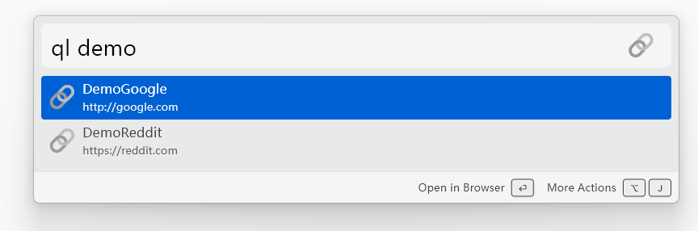

# Quick Links

A [Wox](https://github.com/Wox-launcher/Wox) plugin to save and quickly open named URLs in your browser.



## Install

```
wpm install quicklinks
```

## Usage

| Query                 | Action                      |
| --------------------- | --------------------------- |
| `ql`                  | List all saved links        |
| `ql <search>`         | Filter links by name or URL |
| `ql add <name> <url>` | Save a new link             |

Hit enter to open selected link.

Links can also be managed directly in the Wox settings UI under the Quick Links plugin.
